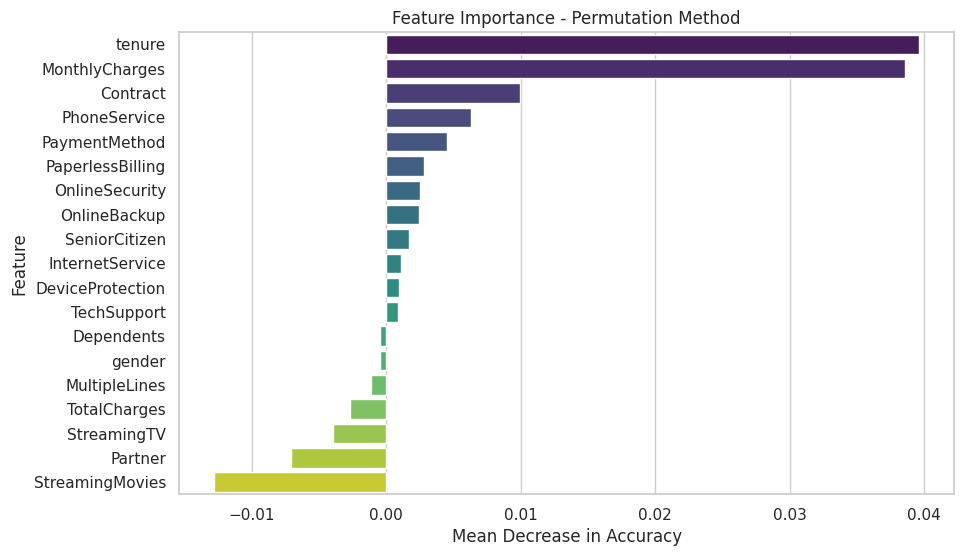

# Customer Churn Prediction Using Neural Networks

## **Overview**
This project focuses on building a machine learning model to predict customer churn using the Telco Customer Churn dataset. Churn prediction is critical for businesses aiming to retain customers and optimize retention strategies. The model leverages a neural network to predict whether a customer will churn based on various features, such as contract type, tenure, monthly charges, and payment methods.

## **Dataset**
- **Source**: The dataset used for this project is the Telco Customer Churn dataset.
- **Description**: This dataset contains information about customers, including demographic data, account information, and whether they churned.

### Key Features:
- **Contract**: Type of contract (Month-to-month, One year, Two year).
- **MonthlyCharges**: Amount charged to the customer monthly.
- **Tenure**: Number of months the customer has been with the company.
- **PaymentMethod**: Customer’s payment method (e.g., Electronic check, Credit card).
- **Churn**: Target variable indicating whether the customer churned (Yes/No).

## **Steps Involved**

### 1. **Data Preprocessing**
- Removed unnecessary columns (e.g., `customerID`).
- Encoded categorical variables using `LabelEncoder` to convert them into numerical format.
- Handled imbalanced data using SMOTE (Synthetic Minority Oversampling Technique).
- Scaled numerical features using `MinMaxScaler` for better model performance.

### 2. **Exploratory Data Analysis (EDA)**
- Analyzed correlations between features and the target variable (`Churn`).
- Visualized data distribution and relationships to identify trends and patterns.

### 3. **Model Building**
- Constructed a neural network using TensorFlow and Keras:
  - **Input Layer**: Accepts 19 input features.
  - **Hidden Layers**: Two layers with 128 neurons and ReLU activation.
  - **Output Layer**: Single neuron with a sigmoid activation function to predict binary outcomes (churn or not).
- Compiled the model using the Adam optimizer and binary cross-entropy loss function.

### 4. **Model Training**
- Split the dataset into training and testing sets (80% train, 20% test).
- Oversampled the minority class in the training set using SMOTE.
- Trained the model for 20 epochs with a batch size of 8.

### 5. **Model Evaluation**
- Evaluated the model on the test set using metrics like:
  - **Accuracy**: Overall correctness of predictions.
  - **Precision**: Proportion of true positive predictions.
  - **Recall**: Proportion of actual positives identified correctly.
  - **F1 Score**: Harmonic mean of precision and recall.
  - **AUC**: Area under the ROC curve to measure classification performance.

## **Key Results**
- The model achieved high accuracy and recall, demonstrating its effectiveness in predicting customer churn.
- Feature importance analysis revealed critical factors influencing churn, such as `MonthlyCharges` and `Contract` type.
- **Analysed impact of each feature on Churn**:

- Interpretation:
- Features at the top of the y-axis are the most important, as permuting them caused the largest drop in accuracy.
- Features with values close to zero on the x-axis are less important, as shuffling them had little impact on the model's performance.

## **Libraries Used**
- **Pandas**: Data manipulation and preprocessing.
- **NumPy**: Numerical computations.
- **Matplotlib/Seaborn**: Data visualization.
- **scikit-learn**: Data preprocessing and metrics.
- **TensorFlow/Keras**: Building and training the neural network.
- **imbalanced-learn**: Handling imbalanced datasets using SMOTE.

## **Future Scope**
- Explore advanced models like XGBoost or Random Forest for comparison.
- Add explainability techniques (e.g., SHAP or LIME) to understand predictions.
- Optimize the model for faster inference and scalability.

## **Acknowledgments**
This project uses the Telco Customer Churn dataset and open-source libraries to implement and evaluate a predictive model. Special thanks to the data science community for making these tools and resources available.

## **Contact**
For questions or feedback, feel free to contact me at [jeetsoni1005@gmail.com].

